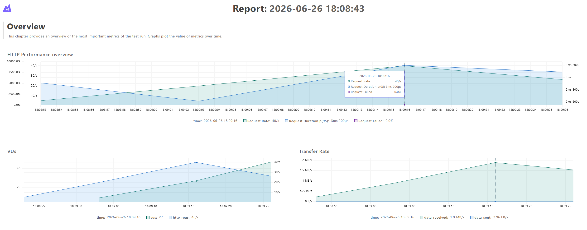
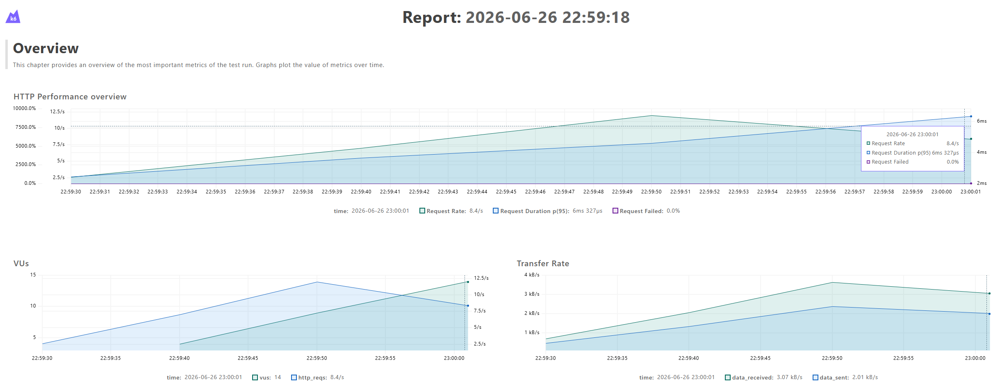
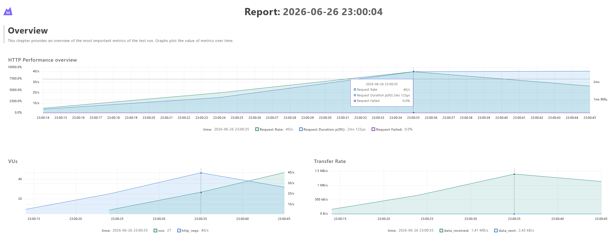
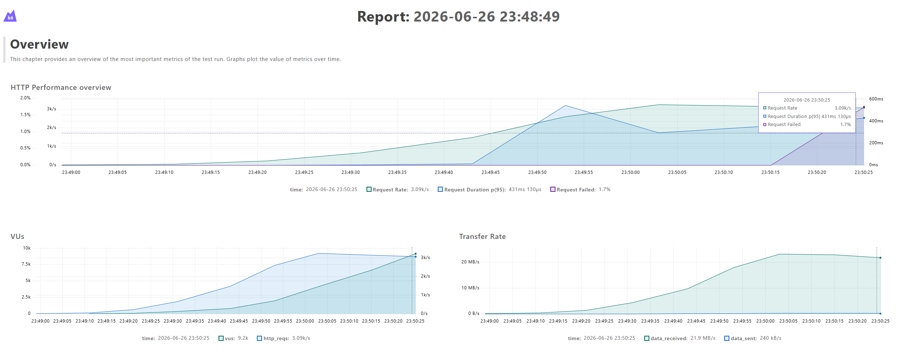
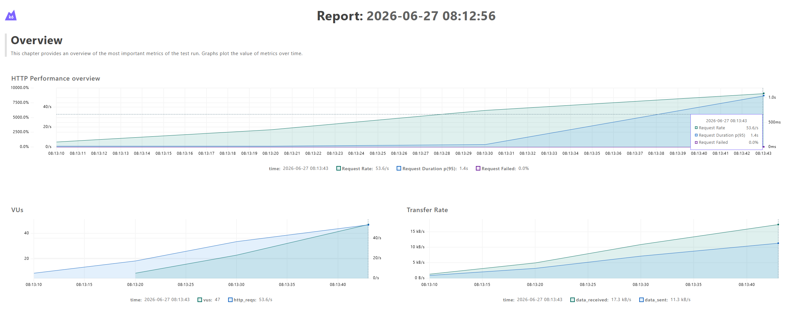

# Projektbericht: Web Application Testing

## 1. Projektinformationen

**Projekt:** Brisk Budget  
**Repository:** <https://github.com/jenninismn/Brisk-Budget>  
**Ursprüngliches Projekt:** <https://github.com/CoppingEthan/Brisk-Budget>  
**Projektmitglieder:** Jennifer Schimani, Daniel Brandsätter  
**Verwendete KI-Werkzeuge:** Gemini + ChatGPT als Beratungswerkzeug, sowie zur Dokumentation und Generierung einzelner Codeabschnitte

## 2. Beschreibung der Webanwendung

Brisk Budget ist eine selbst gehostete Full-Stack-Webanwendung zur Verwaltung persönlicher Finanzen. Benutzerinnen und Benutzer können Konten anlegen, Transaktionen erfassen, Kategorien und Unterkategorien verwalten sowie wiederkehrende Transaktionen und Überweisungen abbilden. Das Dashboard stellt Kontostände, Vermögensentwicklung und Ausgaben grafisch dar.

Das Backend verwendet Node.js mit dem nativen HTTP-Modul. Das Frontend besteht aus Vanilla JavaScript, HTML und CSS. Konten, Transaktionen, Kategorien und weitere Daten werden in JSON-Dateien im Verzeichnis `data/` gespeichert; eine externe Datenbank ist nicht erforderlich. Für die Projektarbeit wurde das öffentliche Repository geforkt und um eine automatisierte Test-Suite ergänzt.

## 3. Teststrategie und Testpyramide

| Testebene | Framework | Anzahl | Schwerpunkt |
|---|---:|---:|---|
| Unit Tests | Jest | 14 | Kategorien- und Hypothekenlogik |
| Integrationstests | Jest | 8 | Kategorien-Routen und JSON-Persistenz |
| System-/E2E-Tests | Playwright | 4 Szenarien / 12 Ausführungen | Kategorien- und Transaktionsabläufe über die UI in Chromium, Firefox und WebKit |
| reguläre Loadtests | k6 | 3 | Homepage sowie Lesen und Erstellen von Kategorien |
| separate Threshold-Tests | k6 | 1 | Leistungsgrenzen beim Lesen Kategorien |


🟩 **LATE:** Ein weiterer Threshold-Test für das Erstellen von Kategorien wurde hinzugefügt

Damit sind 29 unterschiedliche reguläre Testszenarien vorhanden.

### 3.1 Unit Tests

Die Unit Tests werden mit Jest ohne gestarteten Webserver ausgeführt.

#### Kategorienlogik

`tests/unit/categories.test.js` enthält sieben Tests für die Frontend-Klasse `Categories`. Da `public/js/categories.js` als Browser-Skript keine Modulexporte bereitstellt, wird es mit dem Node-Modul `vm` in einem isolierten JavaScript-Kontext geladen. So kann die vorhandene Logik getestet werden, ohne den Produktivcode nur für Tests umzubauen.

Diese Datei wurde ausgewählt, weil im Frontend vergleichsweise viel reine Kategorienlogik implementiert ist, die sich ohne Webserver, Dateisystem oder aufwendige Mocks sinnvoll als Unit Test prüfen lässt.

Geprüft werden:

1. Ermittlung aller Namen von Haupt- und Unterkategorien.
2. Verhalten bei einer leeren Kategorienliste.
3. Ermittlung der Hauptkategorie einer Unterkategorie.
4. Rückgabe von `null` bei einer unbekannten Unterkategorie.
5. Erkennung einer Hauptkategorie durch `getCategoryInfo`.
6. Erkennung einer Unterkategorie einschließlich des Emojis der Hauptkategorie.
7. Definierte Fallback-Werte bei einem unbekannten Kategorienamen.

Diese Tests prüfen deterministische Datenverarbeitung ohne HTTP- oder Dateizugriffe.

#### Hypothekenlogik

`tests/unit/mortgage.test.js` enthält sieben Tests für die Hypothekenberechnung:

Diese Datei wurde ausgewählt, weil sie die einzigste Klasse mit reiner Service-Logik ist und sich daher sehr gut für Unit-Tests eignet

1. `addOneMonth` springt korrekt einen Monat weiter.
2. `addOneMonth` behandelt Monatsende-Überschreitungen korrekt.
3. `accrueOne` ignoriert Konten, die keine Hypotheken sind.
4. Eine inaktive Hypothek wird ignoriert.
5. Ein fehlendes `lastInterestAccrual` wird gesetzt.
6. Für eine offene Hypothek wird eine Zinstransaktion erstellt.
7. Bei null Prozent Zinssatz werden keine Zinsen erstellt.

### 3.2 Integrationstests

Die acht Tests in `tests/integration/categories.test.js` prüfen das Zusammenspiel der Kategorien-Routen, Hilfsfunktionen und JSON-Persistenz. Die produktiven Dateipfade werden mit Jest auf isolierte Testdateien umgeleitet. Das Dateisystem und die JSON-Hilfsfunktionen werden nicht gemockt: Die Tests lesen und schreiben echte Dateien. Lediglich HTTP-ähnliche Request- und Response-Objekte werden für den direkten Aufruf der Route-Handler simuliert. Dadurch werden keine produktiven Daten verändert.

Die Kategorienverwaltung wurde für Integrationstests ausgewählt, weil ihre Route-Handler nicht nur einzelne Funktionen ausführen, sondern Änderungen über mehrere echte JSON-Dateien hinweg konsistent halten müssen.

Geprüft werden:

1. Zurücksetzen auf die Standardkategorien.
2. Lesen vorhandener Kategorien.
3. Erstellen und Speichern einer Kategorie.
4. Aktualisieren einer Kategorie.
5. Löschen einer Kategorie und Ersetzen ihrer Verwendungen.
6. Hinzufügen einer Unterkategorie.
7. Aktualisieren einer Unterkategorie und ihrer Verwendungen.
8. Löschen einer Unterkategorie und Ersetzen ihrer Verwendungen.

Vor und nach den Tests werden die isolierten Dateien entfernt. Wiederholte Testläufe beeinflussen sich daher nicht gegenseitig.

### 3.3 System- und End-to-End-Tests

Die E2E-Tests verwenden Playwright und prüfen vollständige Abläufe vom Browser über das Backend bis zur JSON-Persistenz. Sie werden ausschließlich in Docker und nacheinander mit Chromium, Firefox und WebKit ausgeführt. 🟩 **LATE:** Jeder Browser bekommt jetzt einen neuen Container, damit sich die Läufe nicht gegenseitig blockieren. Nach jedem Browserlauf entfernt die Pipeline die Docker-Compose-Umgebung vollständig. Dadurch beeinflussen die von einem Browser erstellten Kategorien, Konten und Transaktionen keine späteren Browserläufe.

Diese Abläufe wurden ausgewählt, weil Kategorien, Konten und Transaktionen zentrale Funktionen der Anwendung sind und hier das Zusammenspiel von Benutzeroberfläche, Backend und Persistenz als Gesamtsystem geprüft werden soll.

Implementierte Abläufe:

1. Eine Kategorie über die Benutzeroberfläche erstellen.
2. Eine bestehende Kategorie bearbeiten.
3. Einer Kategorie eine Unterkategorie hinzufügen.
4. Ein Konto erstellen und anschließend eine Transaktion anlegen.

Das Page Object Model unter `tests/e2e/pom/` kapselt Navigation, Selektoren und wiederverwendbare UI-Aktionen. Schreibende Abläufe warten auf die zugehörigen HTTP-Antworten. Damit wird neben der UI auch die erfolgreiche Backend-Verarbeitung geprüft.

## 4. Testisolation mit Docker

Docker Compose stellt folgende Services bereit:

| Service | Aufgabe |
|---|---|
| `app` | Startet die Anwendung und stellt einen Healthcheck bereit. |
| `unit` | Führt die Jest Unit Tests aus. |
| `integration` | Führt die Jest Integrationstests aus. |
| `e2e` | Führt Playwright mit Chromium aus. |
| `e2e-firefox` | 🟩 **LATE:** Führt Playwright mit Firefox aus. |
| `e2e-webkit` | 🟩 **LATE:** Führt Playwright mit WebKit aus. |
| `loadtest` | Führt k6 aus und exportiert Dashboards. |

Der App-Service muss seinen Healthcheck bestehen, bevor E2E- oder Loadtests beginnen. Im Compose-Netzwerk ist er über `http://web:3000` erreichbar.

Unit Tests arbeiten mit Daten im Speicher. Integrationstests verwenden eigene Testdateien. Somit greifen keine Teststufen auf produktive Daten zu.

## 5. Testausführung

### 5.1 Voraussetzungen

- Docker Desktop mit Docker Compose
- Node.js 22 und npm
- Git

### 5.2 Gesamte lokale Pipeline

```bash
npm ci
npm run test:pipeline
```

Das plattformunabhängige Node-Skript `scripts/run-test-pipeline.js` führt nacheinander die Bereinigung, Unit Tests, Integrationstests, die E2E-Tests getrennt sowie drei reguläre Loadtests aus. Abschließend wird sie gestoppt. Beim ersten Fehler beendet sich die Pipeline mit einem Fehlercode.
🟩 **LATE:** Es werden jetzt alle 3 Browser bei den e2e Tests verwendet und zwischen den Browsern  wird immer der Container bereinigt.

### 5.3 Einzelne Befehle

```bash
npm test                    # Jest Unit- und Integrationstests
npm run test:pipeline       # vollständige Docker-Testpipeline
npm run test:threshold      # Threshold-Test: Kategorien lesen
npm run test:create:threshold # Threshold-Test: Kategorien erstellen
```

## 6. Continuous Integration

Die CI-Pipeline ist in `.github/workflows/ci.yml` mit GitHub Actions definiert. Sie startet bei Pushes auf `main` und bei Pull Requests gegen `main`. Der Ubuntu-Runner checkt das Repository aus, richtet Node.js 22 ein, installiert Abhängigkeiten reproduzierbar mit `npm ci` und führt anschließend `npm run test:pipeline` aus. Lokal und in CI werden somit dieselben Docker-basierten Schritte verwendet.

Ein Exit-Code ungleich null markiert den Workflow rot; ein erfolgreicher Gesamtlauf wird grün dargestellt.

## 7. Load- und Stresstests

### 7.1 Methodik

Für das Lesen der Kategorien und der Homepage wurden eine maximale Fehlerrate von 1 % und eine p95-Antwortzeit unter 500 ms gewählt, weil diese einfachen Lesezugriffe schnell und nahezu fehlerfrei funktionieren sollen. Beim Erstellen von Kategorien sind wegen der Schreibzugriffe auf die JSON-Datei mehr Aufwand und mögliche Konkurrenz zwischen parallelen Anfragen zu erwarten; deshalb gelten hier mit 5 % Fehlerrate und 750 ms etwas großzügigere Grenzwerte. Die beiden Threshold-Tests verwenden dieselben Grenzwerte wie der jeweils zugehörige reguläre Lese- beziehungsweise Schreibtest und brechen bei deren Überschreitung automatisch ab.

### 7.2 Implementierte Tests

| Datei | Art und Zweck | Lastprofil | Erfolgskriterien |
|---|---|---|---|
| `categories.js` | Read Load Test für `GET /api/categories` | 10 s auf 10 VUs, 20 s bis 50 VUs, 10 s Abbau | Fehlerrate < 1 %, p95 < 500 ms, Status 200, Array als Antwort |
| `categories-create.js` | Write Load Test für `POST /api/categories` und die Persistenz | 10 s auf 5 VUs, 20 s bis 15 VUs, 10 s Abbau | Fehlerrate < 5 %, p95 < 750 ms, Status 201, richtiger Name |
| `homepage-loadtest.js` | Read Load Test für die Startseite | 10 s auf 10 VUs, 20 s bis 50 VUs, 10 s Abbau | Fehlerrate < 1 %, p95 < 500 ms, Status 200 |
| `categories-threshold.js` | Separater Stress-/Threshold-Test für den Kategorien-Endpunkt | stufenweise Erhöhung und automatischer Abbruch | Fehlerrate < 1 %, p95 < 500 ms |
| `categories-create-threshold.js` | 🟩 **NEU:** Separater Stress-/Threshold-Test für `POST /api/categories` | stufenweise Erhöhung bis maximal 1.000 VUs und automatischer Abbruch | Fehlerrate < 5 %, p95 < 750 ms, Status 201, richtiger Name |

Die drei regulären Tests sind Teil der Pipeline. Die beiden aggressiveren Threshold-Tests werden mit `npm run test:threshold` gezielt gestartet, damit ein absichtliches Überschreiten der Leistungsgrenzen nicht jeden CI-Lauf scheitern lässt.
🟩 **LATE:** `npm run test:create:threshold` startet den 2. Thresholdtest

### 7.3 Visualisierung und Analyse

k6 erzeugt über sein integriertes Web Dashboard standardisierte HTML-Visualisierungen. Sie werden bei jedem Pipeline-Lauf neu erzeugt beziehungsweise überschrieben:

- `tests/output/k6/categories-dashboard.html`
- `tests/output/k6/categories-create-dashboard.html`
- `tests/output/k6/homepage-dashboard.html`

Die Dashboards zeigen aktive virtuelle Benutzer, Requests pro Sekunde, Antwortzeiten und Fehlerraten über den zeitlichen Verlauf.

#### Kategorien lesen



*Abbildung 1: Zeitlicher Verlauf von Last, Request-Rate, p95-Antwortzeit und Fehlerrate beim Lesen der Kategorien.*

Die Request-Rate steigt im Diagramm gemeinsam mit der Last an. Am markierten Messzeitpunkt wurden bei 27 aktiven VUs rund 40 Requests pro Sekunde erreicht. Die p95-Antwortzeit lag bei etwa 3,2 ms und die Fehlerrate bei 0 %. Der Kategorien-Endpunkt blieb damit deutlich unter den Grenzwerten von 500 ms und 1 % Fehlern.

#### Kategorien erstellen



*Abbildung 2: Zeitlicher Verlauf von Last, Request-Rate, p95-Antwortzeit und Fehlerrate beim Erstellen von Kategorien.*

Am markierten Messzeitpunkt waren 14 VUs aktiv und es wurden rund 8,4 Kategorien pro Sekunde erstellt. Die p95-Antwortzeit betrug etwa 6,3 ms und die Fehlerrate 0 %. Damit wurden die für den schreibenden Test festgelegten Grenzwerte von 750 ms und 5 % Fehlern deutlich eingehalten.

#### Homepage



*Abbildung 3: Zeitlicher Verlauf von Last, Request-Rate, p95-Antwortzeit und Fehlerrate beim Laden der Homepage.*

Am markierten Messzeitpunkt wurden bei 27 aktiven VUs rund 40 Requests pro Sekunde verarbeitet. Die p95-Antwortzeit lag bei ungefähr 2,1 ms und es traten keine fehlgeschlagenen Requests auf. Die Grenzwerte von 500 ms und 1 % Fehlern wurden somit klar eingehalten.

### 7.4 Threshold-Tests

#### Kategorien lesen



*Abbildung 4: Entwicklung von Last, Durchsatz, Antwortzeit und Fehlerrate bis zum Abbruch des Threshold-Tests.*

Im separaten Threshold-Test wurde die Last auf `GET /api/categories` wesentlich stärker erhöht. Am letzten markierten Messzeitpunkt waren ungefähr 9.200 VUs aktiv und die Anwendung verarbeitete rund 3.090 Requests pro Sekunde. Die p95-Antwortzeit lag dort bei etwa 431 ms; im vorherigen Verlauf ist jedoch auch eine Spitze oberhalb des Grenzwerts von 500 ms sichtbar.

Gegen Ende stieg die Fehlerrate auf 1,7 % und überschritt damit den erlaubten Wert von 1 %. Der Test zeigt somit, auf dass die Grenze knapp unter 3000 Requests pro Sekunde liegt.

#### 🟩 **LATE:** Kategorien erstellen



Abbildung 5: Entwicklung von Last, Durchsatz, Antwortzeit und Fehlerrate beim Erstellen von Kategorien bis zum automatischen Abbruch.*

Der separate Schreib-Threshold-Test erhöht die Last auf `POST /api/categories` stufenweise bis maximal 1.000 VUs. Am letzten im Dashboard dargestellten Messzeitpunkt waren 47 VUs aktiv und es wurden rund 53,6 Requests pro Sekunde verarbeitet. Die p95-Antwortzeit lag bei etwa 1,4 Sekunden und damit über dem festgelegten Grenzwert von 750 ms, während die Fehlerrate bei 0 % lag. Der automatische Abbruch zeigt, dass bei diesem Testlauf die Antwortzeit vor der Fehlerrate zur begrenzenden Größe wurde.

Hinweis: Die Werte gelten nur für die lokale Docker- und Rechnerumgebung und sind nicht auf andere Setups übertragbar.

## 8. Zusammenfassung

Die Test-Suite deckt reine Logik, die Integration mit der JSON-Persistenz, vollständige Benutzerabläufe und das Verhalten unter Last ab. Jest liefert schnelles Feedback für Unit- und Integrationstests. Playwright prüft reale Abläufe aus Benutzersicht. k6 bewertet funktionale Korrektheit und Antwortzeiten bei steigender Parallelität.
